# Traceable Agentic Simulation Architecture

```mermaid
flowchart TD
  A["1. User Input / 用户输入<br/><br/>A messy decision question<br/>一个现实决策问题<br/><br/>Example / 例子：<br/>If high schools replace exams with AI project assessment, what happens?<br/>如果高中取消考试，改用 AI 项目制评价，会怎样？"]

  A --> B["2. Scenario Module / 场景模块<br/><br/>Creates one simulation case<br/>创建一次模拟任务<br/><br/>Stores / 保存：<br/>title 标题<br/>decisionProblem 决策问题<br/>status 当前状态"]

  B --> C["3. WorldSpec + Harness / 世界规格与约束壳<br/><br/>AI drafts the world, harness checks it<br/>AI 先起草世界，Harness 负责检查<br/><br/>Goal / 目标：<br/>turn a question into a runnable simulation blueprint<br/>把问题变成可运行的模拟蓝图"]

  C --> C1["WorldSpec Blueprint / 世界蓝图<br/><br/>What the world contains<br/>这个世界里有什么<br/><br/>zones 地图区域：classroom, office<br/>stakeholders 角色：student, teacher<br/>interventions 干预：replace exams<br/>metrics 指标：fairness, workload"]

  C --> C2["Harness Validation / 约束校验<br/><br/>Gatekeeper before execution<br/>运行前的守门员<br/><br/>Checks / 检查：<br/>each agent has a location 每个角色有位置<br/>all referenced IDs exist 引用 ID 真实存在<br/>metrics are valid 指标有效<br/>JSON shape is correct 格式正确"]

  C2 -->|Fail / 不通过| X["Repair Loop / 修复循环<br/><br/>The system refuses bad worlds<br/>系统拒绝不可运行的世界<br/><br/>Returns concrete errors<br/>返回具体错误<br/><br/>Example / 例子：<br/>student.startZoneId points to missing-zone<br/>学生的位置指向不存在区域"]
  X --> C

  C2 -->|Pass / 通过| D["4. Evidence Module / 证据模块<br/><br/>Stores source-backed facts<br/>保存有来源的事实卡片<br/><br/>Example / 例子：<br/>Admissions systems prefer comparable signals<br/>大学录取更偏好可比较的评价信号"]

  C2 -->|Pass / 通过| E["5. Assumption Module / 假设模块<br/><br/>Stores explicit modeling assumptions<br/>保存明确的模拟前提<br/><br/>Example / 例子：<br/>Resource-rich families can polish projects more<br/>资源强的家庭更容易做出漂亮项目"]

  C1 --> F["6. Compiler Module / 编译模块<br/><br/>Turns blueprint into executable state<br/>把世界蓝图变成可运行状态<br/><br/>Creates / 生成：<br/>agent positions 角色位置<br/>initial metrics 初始指标<br/>active intervention 当前干预<br/>tick = 0 初始时间"]
  D --> F
  E --> F

  F --> G["7. Simulation Runtime / 模拟运行时<br/><br/>Advances the world step by step<br/>一步一步推进世界状态<br/><br/>Each tick updates agents, metrics, and events<br/>每一轮更新角色、指标和事件"]

  G --> H["8. Agent Module / 智能体模块<br/><br/>Stakeholders act inside the world<br/>利益相关者在世界中行动<br/><br/>Loop / 循环：<br/>observe 观察<br/>retrieve evidence 检索证据<br/>reason 推理<br/>act 行动"]

  H --> I["9. Trace Module / 追踪模块<br/><br/>Machine-readable provenance log<br/>机器可读的过程记录<br/><br/>Records / 记录：<br/>who did what 谁做了什么<br/>why 为什么做<br/>evidence used 用了哪些证据<br/>assumptions used 依赖哪些假设<br/>state changes 状态如何变化"]

  I --> J["10. Report Module / 报告模块<br/><br/>Builds auditable claims<br/>生成可审计结论<br/><br/>Every claim must link to<br/>每个结论必须链接到：<br/>evidence 证据<br/>assumptions 假设<br/>trace events 过程事件"]

  J --> K["11. Frontend Visualization / 前端可视化<br/><br/>Human-facing visual trace<br/>给人看的过程展示<br/><br/>Shows / 展示：<br/>map 地图<br/>agents 角色<br/>timeline 时间线<br/>metrics 指标变化<br/>report 报告"]

  D --> V["12. Vector Search / 向量检索<br/><br/>Finds semantically relevant context<br/>按语义找相关上下文<br/><br/>Used by agents and reports<br/>供智能体和报告使用<br/><br/>Searches / 检索：<br/>evidence 证据<br/>assumptions 假设<br/>past trace 历史事件"]
  E --> V
  I --> V
  V --> H
  V --> J
```

## Current Status

| Module | Status |
| --- | --- |
| Scenario | Done |
| WorldSpec / Harness | Done |
| Evidence | Seed data only |
| Assumption | Seed data only |
| Trace | Basic validation done |
| Report | Basic validation done |
| Vector Search | Schema foundation only |
| Compiler | Not started |
| Simulation Runtime | Not started |
| Agent | Not started |
| Frontend Visualization | Scaffold only |
